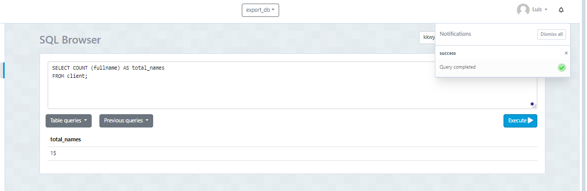
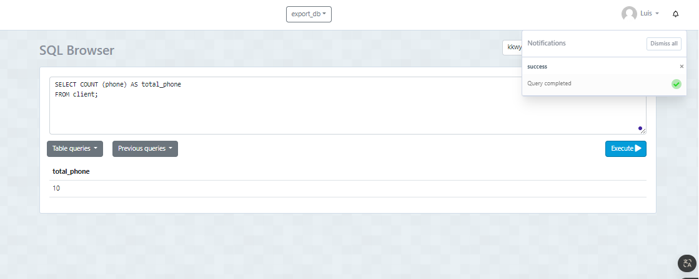
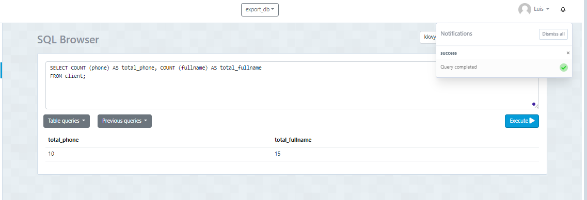
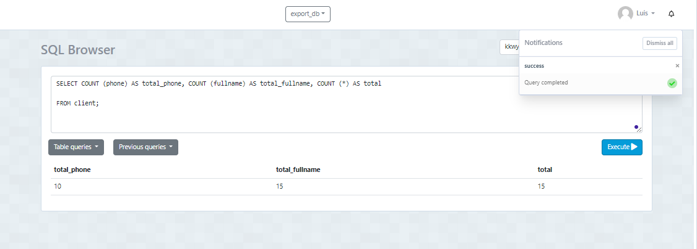
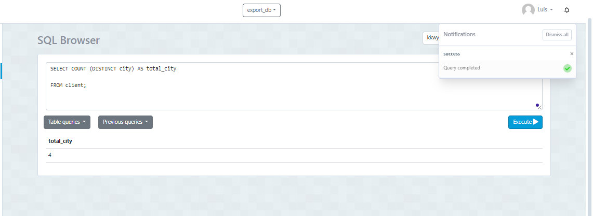

# Tarea en Clase semana 8

## La función count

### Creación de la tabla 

El siguiente código genera la tabla **client**:
```sql
CREATE TABLE client (
    id SERIAL,
    nui VARCHAR (10) NOT NULL,
    fullname VARCHAR (100) NOT NULL,
    phone VARCHAR (10),
    type_of_client VARCHAR (10) DEFAULT 'BASIC',
    city VARCHAR (10), 
    credit_limit DECIMAL(7,2),
    PRIMARY KEY (id)
);

```
### Insertar Datos 
 ```sql
 INSERT INTO client (nui, fullname, phone, type_of_client, city, credit_limit) VALUES
('1234567890', 'John Doe', '1234567890', 'BASIC', 'QUITO', 1000.00),
('0987654321', 'Jane Smith', '0987654321', 'PREMIUM', 'GUAYAQUIL', 2000.00),
('1122334455', 'Alice Johnson', '1122334455', 'BASIC', 'CUENCA', 1500.00),
('2233445566', 'Bob Brown', '2233445566', 'BASIC', 'MANTA', 1800.00),
('3344556677', 'Charlie Davis', '3344556677', 'PREMIUM', 'QUITO', 2500.00),
('4455667788', 'Dana Wilson', '4455667788', 'BASIC', 'GUAYAQUIL', 1100.00),
('5566778899', 'Eve Martinez', '5566778899', 'BASIC', 'CUENCA', 1200.00),
('6677889900', 'Frank Garcia', '6677889900', 'PREMIUM', 'MANTA', 2300.00),
('7788990011', 'Grace Lee', '7788990011', 'BASIC', 'QUITO', 1300.00),
('8899001122', 'Hank Kim', '8899001122', 'BASIC', 'GUAYAQUIL', 1400.00);

```
### Insertar 5 Datos sin el phone 
```sql
INSERT INTO client (nui, fullname, type_of_client, city, credit_limit) VALUES
    ('9900112233', 'Ivy Brown', 'BASIC', 'QUITO', 1500.00),
    ('0011223344', 'Jack White', 'PREMIUM', 'GUAYAQUIL', 2200.00),
    ('2233445567', 'Karen Green', 'BASIC', 'CUENCA', 1700.00),
    ('3344556678', 'Liam Black', 'PREMIUM', 'MANTA', 2600.00),
    ('4455667789', 'Mia Blue', 'BASIC', 'QUITO', 1900.00);
```
## Mostra nombre 
#### Para mostrar todos los nombres usamos la funcion *COUNT ()* pasandole commo un paramatre el campo , en este caso *fullname*
```sql
SELECT COUNT (fullname) AS total_names
FROM client;
```


## Mostra Telefono 
#### Esta consulta devuelve un solo valor que representa la cantidad total de registros en la tabla client que tienen un valor en la columna phone. Este valor se etiqueta como total_phone en el resultado de la consulta.
```sql
SELECT COUNT (phone) AS total_phone
FROM client;
```


# Mostrar telefono y nombre 
#### Cuenta cuántos registros tienen datos en las columnas phone y fullname de la tabla client. Los resultados se muestran como total_phone y total_fullname, indicando el número de valores no nulos en cada columna.

```sql
SELECT COUNT (phone) AS total_phone, COUNT (fullname) AS total_fullname
FROM client;
```


# Mostrar telefono, nombre y tolal 
#### La consulta será una fila con tres columnas: total_phone, total_fullname y total, que indican, respectivamente, el número de teléfonos, nombres completos y el total de filas en la tabla.

```sql
SELECT COUNT (phone) AS total_phone, COUNT (fullname) AS total_fullname, COUNT (*) AS total
FROM client;
```


# Mostrar las ciudades que hay 
#### Cuenta cuántas ciudades únicas hay en la tabla "client" y devuelve ese número con el alias "total_city". Específicamente, la función COUNT(DISTINCT) cuenta el número de valores distintos en la columna "city".
```sql
SELECT COUNT (DISTINCT city) AS total_city
FROM client;
```

